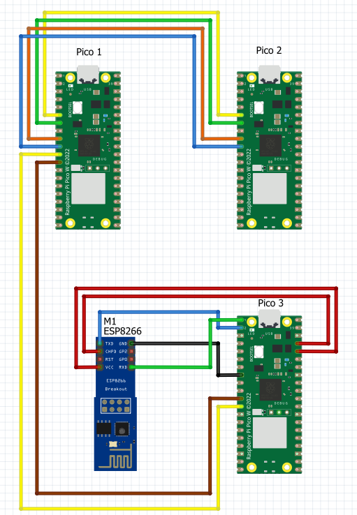
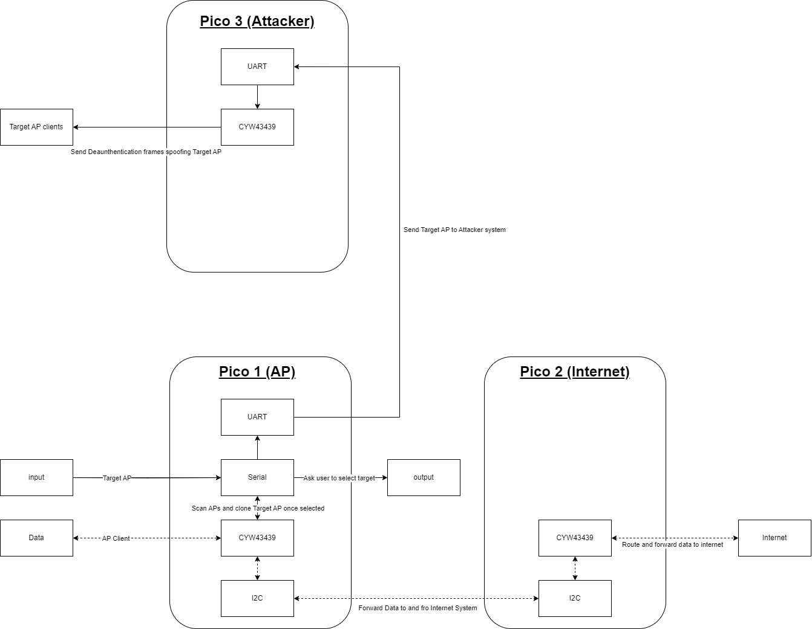
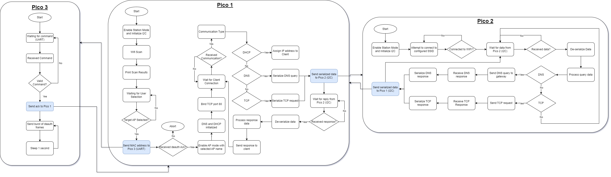
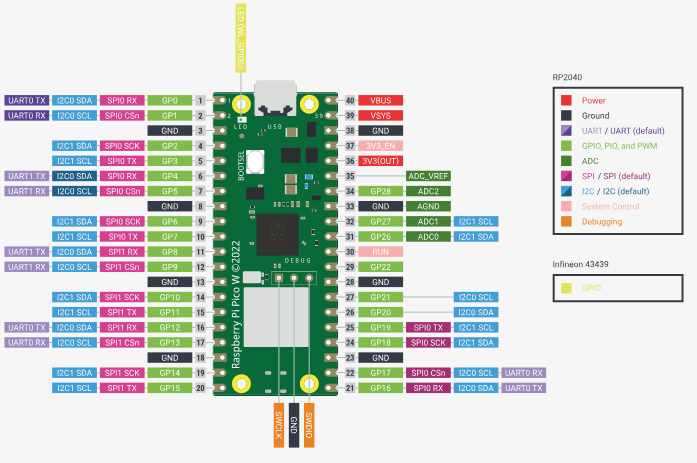

# Rogue AP-ico
Rogue AP-ico is a tool utilizing the Raspberry Pi Pico W to perform an Evil Twin attack on a wireless access point. It was developed in C and requires the use of 3 separate Pico W systems.

## Why Pico W?
The Raspberry Pi Pico W, equipped with on-board Wi-Fi (802.11n), is well-suited for man-in-the-middle (MitM) attacks. Its ability to capture and manipulate wireless communications makes it a practical choice. With the Pico W, you can intercept data, modify it as needed, and then send it to clients, facilitating effective MitM operations. This streamlined process makes the Pico W an accessible and efficient option for carrying out MitM attacks.

## Setup
Pico 1 and Pico 2 will have to be connected on the following GPIOs to faciliate internet connectivity betwen I2C:
|Pico 1 Pins|Pico 2 Pins|
|-|-|
|GP4|GP4|
|GP5|GP5|
|GP6|GP6|
|GP7|GP7|

Pico 1 and Pico 3 will have to be connected on the following GPIOs to facilitate the conduct of the deauth attack.
|Pico 1 Pins|Pico 3 Pins|
|-|-|
|GP8|GP9|
|GP9|GP8|

Additonally, Pico 3 will need to be connected to the ESP01 Wi-Fi module on the following pins to utilize it:
|Pico 3 Pins|ESP01 Pins|
|-|-|
|GP0|RXD|
|GP1|TXD|
|3v3|VCC|
|3v3_EN|CHEN / CHPD|
|GND|GND|

### Optional Setup (with SD Card)
The attack flow remains functional even if there is no access to an SD card. You can control this option by adjusting the `SD_MOUNTED` flag in the [CMakeLists.txt](src/CMakeLists.txt) file. If your system is configured with an SD card, and you want to avoid accidental data overwriting, you can also manage the `PCAP_OVERWRITE` flag. Additionally, remember to initialize the pcap file by calling the [set_pcap_file()](src/pcap_helper/pcap.c#L8). 

The following GPIOs will need to be connected to an SD card reader to write packets to the pcap file:

|Pico Pins|SD Card Pins|
|-|-|
|3V3|3V3|
|GND|GND|
|GP8|MISO|
|GP9|CS|
|GP10|CLK|
|GP11|MOSI|

## Block Diagram
Pico 1 initiates Wi-Fi scanning, selects a target, and triggers a deauthentication attack via UART on Pico 3. After disconnecting clients, Pico 1 transforms into an access point, routing client traffic to Pico 2 via I2C. Pico 1 stores client packets on an SD card for analysis while seamlessly facilitating internet browsing by relaying requests between clients and Pico 2.

## Flow Chart
This flowchart shows a comprehensive overview of how our system works, breaking down the different parts that come together for the entire attack process.

## Pico-W Pinout

