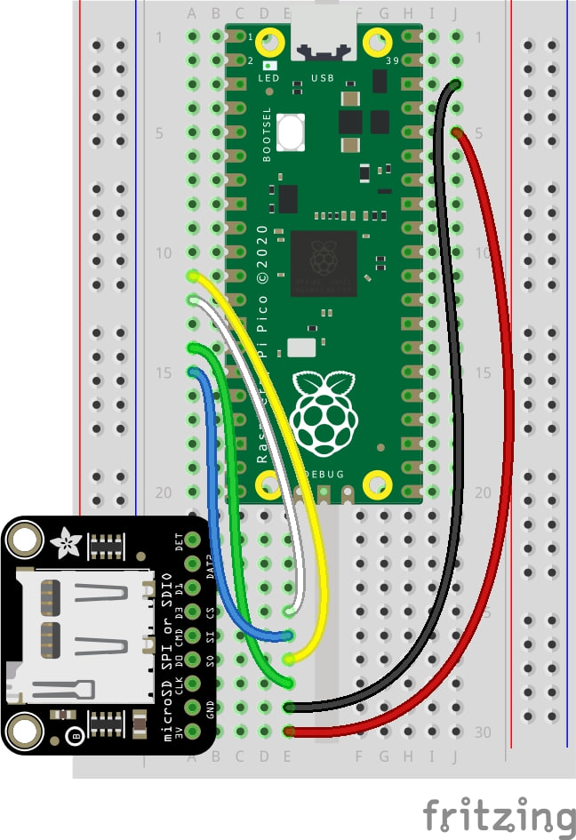

# Rogue AP-ico
Rogue AP-ico is a tool utilizing the Raspberry Pi Pico W to perform an Evil Twin attack on a wireless access point. It was developed in C and requires the use of 3 separate Pico W systems.

## Block Diagram

## Flow Chart

## Setup

## Optional Setup (with SD Card)

## Pico-W Architecture

